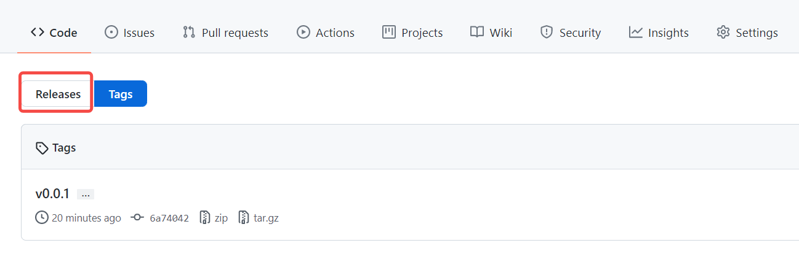

# 发布流程

在solhedge-fe和solhedge-be项目dev和test新增tag, GitHub会发送POST请求到CI服务, CI会自动拉取该tag代码, 并编译更新对应的服务.

## tag命名建议
任意tag都会触发, 命名并没有严格的要求, 这里只是建议. dev分支命名为devX.x.x, 如dev1.0.0, test分支命名为testX.x.x, 如test1.0.0, vX.x.x保留为以后的正式版本使用.

## tag新增方式

### 1. 基于Github

a. 进入项目主页, 点击进入tag

b. 在tag页, 进入Releases页面, 点击右上角"Draft a new release"

c. 填写版本号, 选择对应分支, 这里是dev或test, 最后点击最下面的"Publish release"就会触发CI.

### 本地Git

a. 新建tag, 基于git命令, sourceTree, idea等, git命令为`git tag dev1.0.0`
b. 推送tag至GitHub, git命令为`git push origin dev1.0.0`. SourceTree和Idea推送的时候需要勾选"push tags"选项.

